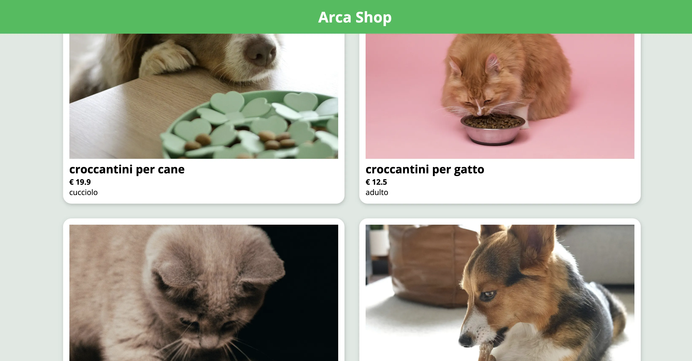

# 🐾 Arca Shop – PHP OOP E-commerce Simulation

> [!NOTE]
>
> **“Arca Shop” – un e-commerce simulato per articoli destinati agli animali**, interamente sviluppato in **PHP ad oggetti** come esercizio pratico di architettura logica e programmazione modulare.
> _Il progetto si contrenta solo sulla logicha di rappresentazione e non sulla logica di funzionamento di un vero e-commerce_

---

## 🧭 Panoramica

**Arca Shop** è un progetto PHP OOP che simula il funzionamento base di un e-commerce dedicato al mondo degli animali domestici.  
L’obiettivo era quello di mettere in pratica i concetti fondamentali della **programmazione a oggetti**, progettando una struttura solida, estendibile e facilmente manutenibile.

L’intero progetto è stato **ideato, sviluppato e strutturato da Samuele Paratore (byHYONS)**, con particolare attenzione alla **logica del dominio** (categorie, prodotti, clienti, gestione carrello) e all’organizzazione del codice secondo i principi OOP.

---

## 🎯 Obiettivi e logica del progetto

L’idea di base era creare un **mini e-commerce simulato**, in cui ogni elemento del negozio (prodotto, categoria, cliente, carrello, ecc.) fosse rappresentato da una **classe PHP** con responsabilità ben definite.

### Caratteristiche principali:

- 🧩 **Programmazione completamente ad oggetti**  
  Suddivisione del codice in classi indipendenti con attributi e metodi dedicati.

- 🐶 **Gestione categorie e prodotti**  
  Classi specifiche per prodotti e sottocategorie (es. cibo, accessori, giochi).

- 🧱 **Ereditarietà e polimorfismo**  
  Ogni tipo di articolo eredita da una classe base e può estendere le proprie funzionalità.

- ⚙️ **Struttura modulare**  
  File separati per modello, logica e presentazione, con uso mirato di `require` e `include`.

- 💾 **Gestione dei dati**  
  Simulazione di database tramite array e oggetti PHP.

- 🎨 **Interfaccia semplice ma funzionale**  
  Visualizzazione chiara dei prodotti, con prezzo, descrizione e categoria.

---

---

## 🧩 Stack tecnologico

- **PHP 8+** – Programmazione orientata agli oggetti
- **HTML5 / CSS3** – Struttura e interfaccia visuale del progetto
- **OOP Design Patterns** – Incapsulamento, ereditarietà, polimorfismo
- **Neovim** – Ambiente di sviluppo
- **Git & GitHub** – Versioning e gestione repository

---

## 🧠 Architettura del progetto

### Descrizione:

Immaginare quali sono le classi necessarie per creare uno shop online con le seguenti caratteristiche:

- L'e-commerce vende _prodotti_ per animali.
- I prodotti sono categorizzati, le _categorie_ sono Cani o Gatti.
- I prodotti saranno oltre al _cibo_, anche _giochi_, _cucce_, etc...

Stampiamo delle card contenenti i dettagli dei prodotti, come immagine, titolo, prezzo, icona della categoria ed il tipo di articolo che si sta visualizzando (prodotto, cibo, gioco, cuccia).

---

byHYONS™
